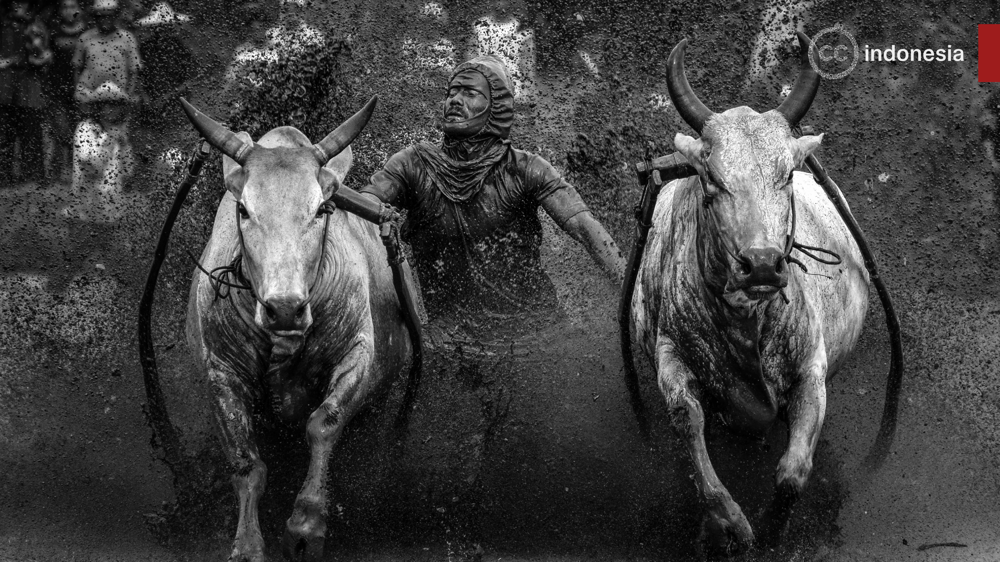

# Images made for Creative Commons Indonesia

## Background images

Most background images are sourced from the [Wiki Cinta Budaya 2020](https://commons.wikimedia.org/wiki/Campaign:wlc-id) campaign.

### Rights and attribution

**File:** [ccid-bakar-tongkang-prosesi.jpg](backgrounds/jpg/ccid-bakar-tongkang-prosesi.jpg)  
**Original:** "Bakar tongkang prosesi" by [Agustinuselwan](https://commons.wikimedia.org/wiki/User:Agustinuselwan), [https://commons.wikimedia.org/wiki/File:Bakar_tongkang_prosesi.jpg](https://commons.wikimedia.org/wiki/File:Bakar_tongkang_prosesi.jpg), [CC BY-SA 4.0](https://creativecommons.org/licenses/by-sa/4.0/deed.en)  
**Modifications:** duochrome (black + white), cropped  
**License:** [CC BY-SA 4.0](https://creativecommons.org/licenses/by-sa/4.0/deed.en)

**File:** [ccid-bercerita-dengan-wayang.jpg](backgrounds/jpg/ccid-bercerita-dengan-wayang.jpg)  
**Original:** "Bercerita dengan Wayang" by [Candra Firmansyah](https://commons.wikimedia.org/wiki/User:Candra_Firmansyah), [https://commons.wikimedia.org/wiki/File:Bercerita_dengan_Wayang.jpg](https://commons.wikimedia.org/wiki/File:Bercerita_dengan_Wayang.jpg), [CC BY-SA 4.0](https://creativecommons.org/licenses/by-sa/4.0/deed.en)  
**Modifications:** duochrome (black + white), cropped  
**License:** [CC BY-SA 4.0](https://creativecommons.org/licenses/by-sa/4.0/deed.en)

**File:** [ccid-pacu-jawi-minangkabau.jpg](backgrounds/jpg/ccid-pacu-jawi-minangkabau.jpg)  
**Original:** "Pacu Jawi Minangkabau" by Deni Dahniel, [https://commons.wikimedia.org/wiki/File:DSC_3027_wikimedia2020_deni_dahniel_Atraksi_Pacu_Jawi_Minangkabau_.jpg](https://commons.wikimedia.org/wiki/File:DSC_3027_wikimedia2020_deni_dahniel_Atraksi_Pacu_Jawi_Minangkabau_.jpg), [CC BY-SA 4.0](https://creativecommons.org/licenses/by-sa/4.0/deed.en)  
**Modifications:** duochrome (black + white), cropped  
**License:** [CC BY-SA 4.0](https://creativecommons.org/licenses/by-sa/4.0/deed.en)

**File:** [ccid-penari-warok.jpg](backgrounds/jpg/ccid-penari-warok.jpg)  
**Original:** "Penari warok" by Oki sobara, [https://commons.wikimedia.org/wiki/File:Penari_warok.jpg](https://commons.wikimedia.org/wiki/File:Penari_warok.jpg), [CC BY-SA 4.0](https://creativecommons.org/licenses/by-sa/4.0/deed.en)  
**Modifications:** duochrome (black + white), cropped  
**License:** [CC BY-SA 4.0](https://creativecommons.org/licenses/by-sa/4.0/deed.en)

**File:** [ccid-peresean-ritual.jpg](backgrounds/jpg/ccid-peresean-ritual.jpg)
**Original:** "Peresean ritual of Sasak people of Lombok" by Ketut Mardita, [https://commons.wikimedia.org/wiki/File:Peresean_ritual_of_Sasak_people_of_Lombok.jpg](https://commons.wikimedia.org/wiki/File:Peresean_ritual_of_Sasak_people_of_Lombok.jpg), [CC BY-SA 4.0](https://creativecommons.org/licenses/by-sa/4.0/deed.en)  
**Modifications:** duochrome (black + white), cropped  
**License:** [CC BY-SA 4.0](https://creativecommons.org/licenses/by-sa/4.0/deed.en)

**File:** [ccid-presean-traditional-stick-fight.jpg](backgrounds/jpg/ccid-presean-traditional-stick-fight.jpg)  
**Original:**  "Presean traditional stick fight" by Hadiyat Ramantara, [https://commons.wikimedia.org/wiki/File:Presean_traditional_stick_fight.jpg](https://commons.wikimedia.org/wiki/File:Presean_traditional_stick_fight.jpg), [CC BY-SA 4.0](https://creativecommons.org/licenses/by-sa/4.0/deed.en)  
**Modifications:** duochrome (black + white), cropped  
**License:** [CC BY-SA 4.0](https://creativecommons.org/licenses/by-sa/4.0/deed.en)

**File:** [ccid-tarian-kidung-tengger.jpg](backgrounds/jpg/ccid-tarian-kidung-tengger.jpg)  
**Original:** "Tarian kidung tengger" by Muhammad ikbar nkc, [https://commons.wikimedia.org/wiki/File:Tarian_kidung_tengger.jpg](https://commons.wikimedia.org/wiki/File:Tarian_kidung_tengger.jpg), [CC BY-SA 4.0](https://creativecommons.org/licenses/by-sa/4.0/deed.en)  
**Modifications:** duochrome (black + white), cropped  
**License:** [CC BY-SA 4.0](https://creativecommons.org/licenses/by-sa/4.0/deed.en)

**File:** [ccid-tenun-ulos.jpg ](backgrounds/jpg/ccid-tenun-ulos.jpg)  
**Original:** "Tenun Ulos" by Maula039, [https://commons.wikimedia.org/wiki/File:Tenun_Ulos.jpg](https://commons.wikimedia.org/wiki/File:Tenun_Ulos.jpg), [CC BY-SA 4.0](https://creativecommons.org/licenses/by-sa/4.0/deed.en)  
**Modifications:** duochrome (black + white), cropped  
**License:** [CC BY-SA 4.0](https://creativecommons.org/licenses/by-sa/4.0/deed.en)
